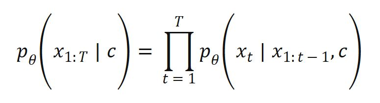
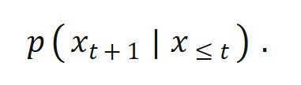
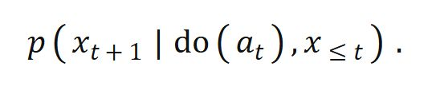
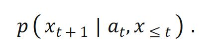
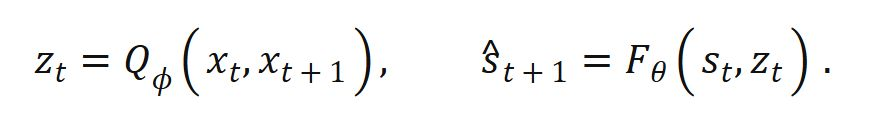
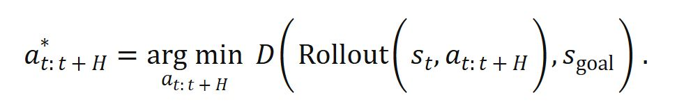
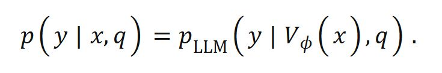

# 当视频生成开始预测动作后果：多模态能力还能全部归因于 LLM 吗？

过去两年，潜在动作模型、动作条件预测器和模型预测控制连续出现在视频生成研究中。研究目标也由条件视频合成扩展到干预后的状态预测：系统不仅要生成下一帧，还要估计某个动作会改变哪些状态。能力归因因此变得具体——如果最终解码器是 LLM，时空表征、物理预测和可执行规划是否也都来自 LLM？

现有证据不支持全部归因于 LLM。视频理解、物理推理和规划都包含多个层次，其中一部分可以从语言预训练中迁移，另一部分依赖视频、动作和环境反馈。统一架构并不意味着能力具有单一来源。

视频理解首先包含物体识别、动作命名和事件描述。这些任务与语言概念高度相关，LLM 提供的语义知识具有明显作用。但视频理解还包括目标跟踪、运动方向、遮挡关系、状态变化和动作预期，这些信息主要来自视频的时序结构。

自回归视频模型通常学习条件视频分布：

其中 `x_t` 表示视频帧，`c` 可以是文本、图像、动作或轨迹。扩散模型采用不同的生成过程，但同样需要拟合视觉时空分布。训练数据中反复出现的下落、碰撞、流动和形变会形成相应的统计表征，目标函数中通常没有质量守恒、动量守恒或接触方程等显式约束。

V-JEPA 2 提供了较明确的能力分解。其视频编码器先通过大规模视频自监督训练形成时空表征；视觉表征与语言模型对齐后，视频问答性能进一步提高；使用机器人视频训练动作条件预测器 V-JEPA 2-AC 后，系统可以在模型预测控制中完成新环境下的机器人规划。三个训练阶段分别增加视频、语言和动作信息。

物理推理也需要区分不同形式。文本语料包含重力、碰撞和摩擦等常识，因此 LLM 可以回答相应的语言问题。具体场景中的状态预测还需要位置、速度、材料属性、接触关系和环境约束。这些连续变量通常无法从文本记录中完整恢复。

普通视频预测主要估计观察条件下的后续状态：

面向控制的物理推理还要估计动作干预后的状态：

前一个分布可以从被动视频中估计；后一个分布需要动作记录、受控实验或具有充分状态覆盖的交互数据。如果动作选择还依赖未观测变量，普通条件分布可以写为：

该条件分布与干预分布仍可能存在差异，因此还需要状态覆盖、随机化控制或相应的因果假设。

潜在动作模型尝试从没有动作标签的视频中提取可控变化：

其中 `z_t` 表示相邻状态之间的低维变化，`F_θ` 根据当前状态和潜在动作预测后续状态。Genie 采用时空视频分词器、自回归动力学模型和潜在动作模型，可以从没有真实动作标签的互联网视频中训练可控生成环境。这说明一部分动作结构可以直接从视频变化中形成。

潜在动作不能自动对应现实中的力、方向或关节控制量。只要预测损失保持不变，潜在动作编号可以交换，潜在空间也可以进行可逆变换。相机移动、主体运动和背景变化还可能被编码到同一个变量中。潜在动作主要提供可控变化的表示，其物理含义仍需通过动作标签、机器人本体感觉、干预实验或下游控制结果确认。

论文中所说的智能体通常位于训练或推理闭环。网络内部增加的组件一般称为动作条件、潜在状态、策略接口或价值函数。智能体产生交互轨迹，世界模型预测动作结果，控制器再根据目标选择动作。

在模型预测控制中，动作选择可以写为：

系统执行序列中的第一个动作，获得新的环境观测，再计算后续动作。真实反馈会持续检验动力学预测误差。LLM 可以解析自然语言目标、生成步骤和完成高层任务分解；计划进入物理环境后，动作条件世界模型还要判断动作会如何改变环境，控制算法则根据反馈修正后续动作。

因此，语言规划能力和可执行规划能力需要分别分析。高层步骤可以主要来自语言与代码训练，物理可行性还取决于当前视觉状态、动作条件转移和闭环反馈。语言上合理的步骤无法直接保证动作可行。

典型视觉语言模型可以写成：

其中 `V_φ(x)` 是视觉编码结果，`q` 是文本问题，`y` 是输出。最终结果由语言模型解码，与视觉相关的信息仍来自视觉编码器及其训练数据。仅根据输出模块的位置判断能力来源，会遗漏输入表征的作用。PaLM-E 的联合训练结果也显示，语言、视觉和机器人数据之间存在正迁移。

现有视频生成评测进一步说明，语言知识无法直接保证物理一致性。VideoPhy 测试了固体、流体及其交互场景。在该研究覆盖的模型中，最高结果仅在 39.6% 的样本上同时满足文本条件和物理规律。VideoPhy-2 增加了更复杂的动作，困难子集中的最高联合结果为 22%，质量守恒和动量守恒也是常见问题。这些结果对应特定模型和评测时间，但足以说明语言对齐、视觉质量和物理一致性需要分别测量。

> 更准确的能力归因是：视频理解中的语义部分可以大量受益于 LLM，时空表征依赖视频训练；物理常识可以来自 LLM，场景动力学和动作后果依赖视频与交互数据；高层规划可以由 LLM 完成，可执行规划还依赖动作条件世界模型、控制算法和真实反馈。

未来系统可能使用统一的 Transformer 参数处理文本、图像、视频、音频和动作。参数统一不会消除信息来源的差异。视频学习仍需处理长期状态、多种可能未来和误差累积；三维视觉仍需处理几何、遮挡和跟踪；机器人学与控制理论仍需处理动作、反馈和稳定性；因果推断仍需区分观察相关性与干预结果。

多模态系统的统一可以发生在参数层面，也可以发生在输入输出形式上。物理能力的形成仍然要求连续观测、动作和环境反馈。LLM 能够组织这些信息，但无法单独提供训练语料中缺失的物理状态与干预结果。视频理解、物理推理和规划均有一部分来自 LLM，没有全部来自 LLM。

**参考资料**

- [Bruce et al., *Genie: Generative Interactive Environments*, 2024](https://deepmind.google/research/publications/60474/)
- [Assran et al., *V-JEPA 2: Self-Supervised Video Models Enable Understanding, Prediction and Planning*, 2025](https://arxiv.org/abs/2506.09985)
- [Driess et al., *PaLM-E: An Embodied Multimodal Language Model*, 2023](https://arxiv.org/abs/2303.03378)
- [Bansal et al., *VideoPhy: Evaluating Physical Commonsense for Video Generation*, 2024](https://arxiv.org/abs/2406.03520)
- [Bansal et al., *VideoPhy-2: A Challenging Action-Centric Physical Commonsense Evaluation in Video Generation*, 2025](https://arxiv.org/abs/2503.06800)
