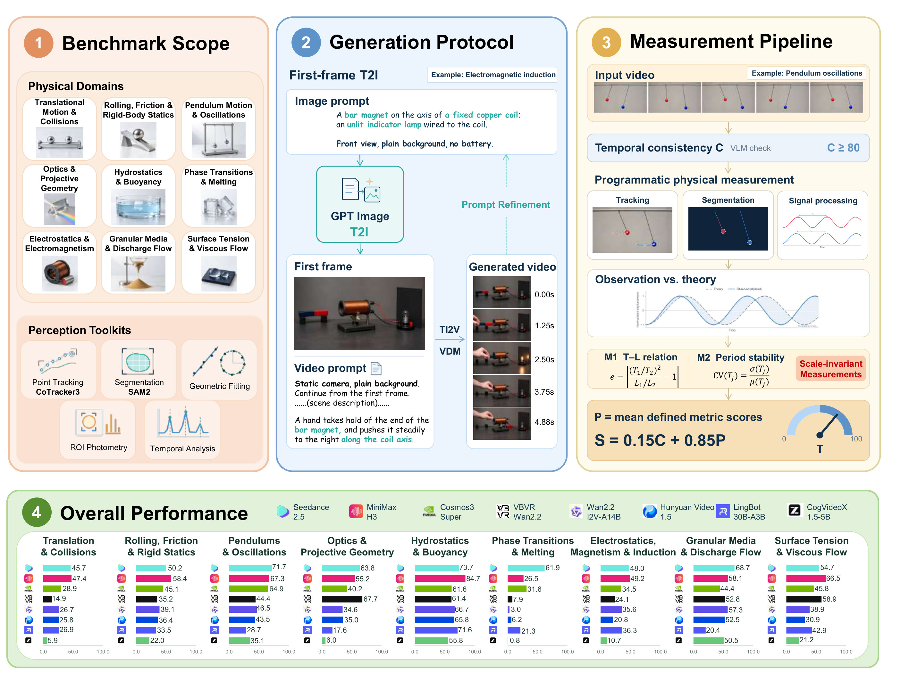
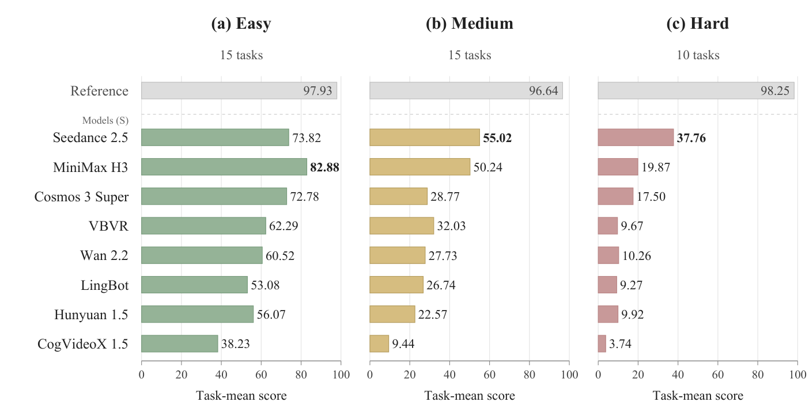
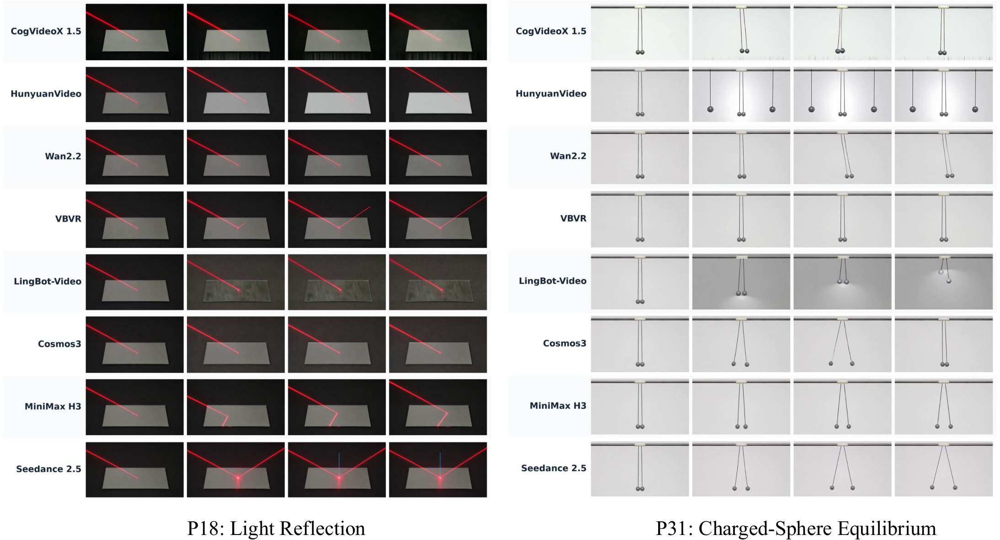

如果视频生成模型要作为 world model 用于预测、规划或具身交互，不能只看视觉保真度和时序连续性，还要看物理能力。

Einsia AI发布了 [World Models' Last Exam in Physics](https://arxiv.org/abs/2610.08791)——视频模型生成的画面好看，物理上如何？

40 个受控任务，作者用八个视频模型一共生成了 1,280 段视频。先看物体和事件在视频里是否始终可观测；再从视频中提取运动轨迹、角度、周期、液面高度和预先设定做对照。

综合得分最高的 Seedance 2.5 只有 57.76/100。“含石头的冰块融化”任务平均 3.45 分。光反射和带电小球平衡两个任务两极分化：有的模型接近满分，有的连 15 分都没。

论文的综合分数把一致性和物理测量分开。设 $C(V)$ 为时序一致性与可观测性分数，$P(V)$ 为物理测量分数：

\[
S(V)=0.15C(V)+0.85\widetilde P(V),\qquad \widetilde P(V)=
\begin{cases}
P(V),&C(V)\geq80,\\
0,&C(V)<80.
\end{cases}
\]

自由落体中，所有视频都通过了时序一致性检查，画面连贯，物体也没有凭空消失，但跨模型平均分只有 26.61。看起来连贯和符合重力完全是两回事。

对于其中的抛体运动，论文会比较高度 $H$ 与水平射程 $R$ 的关系：

\[
r_{\mathrm{spatial}}=\left|\frac{H}{R}-\frac14\right|.
\]

现有的许多实验结论已经说明画面变好不会自动带来物理能力。原因也许是数据和训练目标：视频数量庞大但很多缺少运动和系统性的干预数据，比如同一个物体在不同质量、速度、受力和环境下分别会怎样。现在很多方法主要围绕时序连续、画面保持度，对物理守恒关系和长期因果的约束还很弱。

在业界，模型+数据变大后，物理得分确实有稳定上升。但保持其他不变，完全靠堆参数和数据真的是最好的解决办法吗？

对学界大部分团队来说，现实困境是在大模型上验证方法等所需的算力几乎不可得，能做的也许只能是一个新 benchmark 或者一小组高质量的反事实数据。

不知学界论文爆炸的当下，真正能被 scale 的新方法在哪里？

## 参考资料

- [World Models' Last Exam in Physics](https://arxiv.org/abs/2610.08791)
- [VideoPhy](https://arxiv.org/abs/2406.03520)
- [PhyWorldBench](https://research.nvidia.com/labs/cosmos-lab/phyworldbench/)
- [V-JEPA 2](https://arxiv.org/abs/2506.09985)
